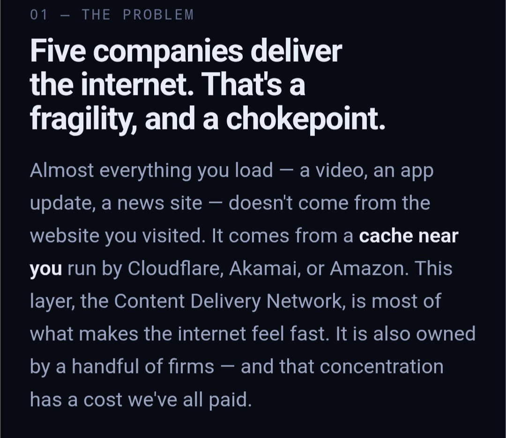
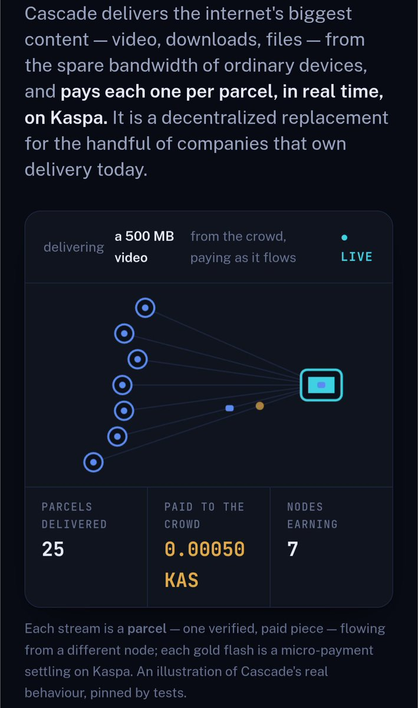
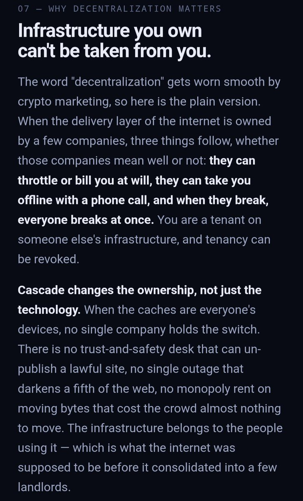
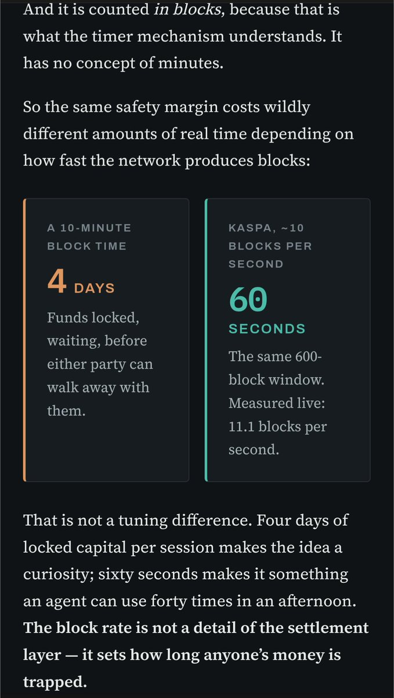
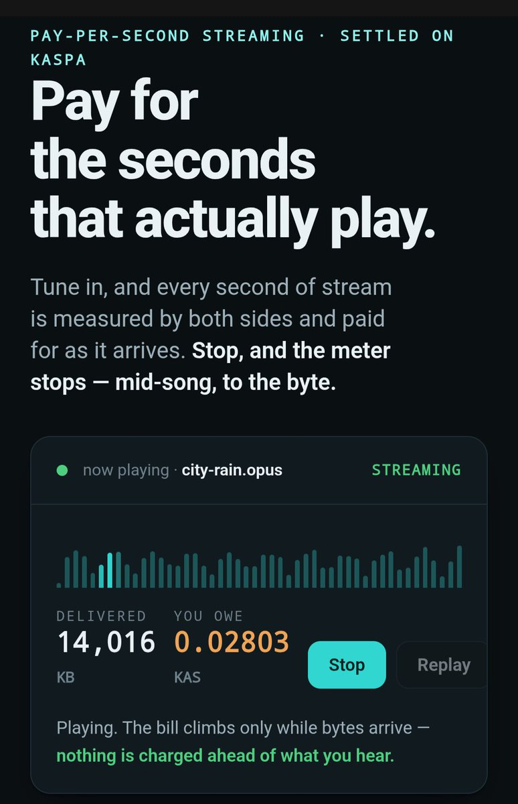

# Review: kaspahttp402 / Cascade (kascade)

**Subject:** Mosh Jan ([@bathtoob30](https://x.com/bathtoob30)), GitHub [kaspahttp402](https://github.com/kaspahttp402).  
**Ask:** “I wouldn't mind get your eye on some theoretical/in progress ideas I have.”  
**This is:** a code-and-claim review of the public work. Not an audit. Not a rewrite.

---

## What I did

1. Read the X request and the surrounding thread.
2. Read the X profile. Bio: “Agent-2-Agent API marketplace using Kaspa.” Links go to `kaspai.win` and a gated Claude artifact.
3. Tried the Claude artifact he posted as the idea dump. **Login wall. Unreadable.** So it is not a reviewable spec.
4. Opened the GitHub account he is actually shipping from: [github.com/kaspahttp402](https://github.com/kaspahttp402). Six public repos. That is the work.
5. Read kascade source, tests, settlement, creditline, tracker, fount, paid pull/gather, seed, keys, wallet, channel, and the live-proof script.
6. Read the sibling READMEs: metered-protocol, spigot, flume, quorum, and the archived kaspa-x402 client.
7. Included his own landing-page screenshots (same author) so the pitch and the code sit next to each other.

## Why I did it that way

He asked for a take, not a cheer. Parker’s reply in the same thread was “pass links / GitHub so an agent can file what it finds.” Public git is the only durable artifact. A Claude share link is not.

I did **not** re-run his TN10 proofs in this session. I treated claimed txids as *his* evidence, not mine. Where the code contradicts the copy, the code wins.

---

## What this actually is

A stacked TypeScript prototype for **pay-as-bytes-arrive**, settled through Kaspa x402 `batch-settlement` escrow on **testnet-10**.

| Layer | Job | State |
|---|---|---|
| **metered-protocol** | Both sides count one slice; buyer signs a rising voucher ceiling; rail moves money | Strongest piece. Spec, TS + Python, conformance vectors. TN10. |
| **spigot** | One seller, one file, pay per byte | Real. Dust floor documented. |
| **flume** | Same meter, open-ended stream | Real in-process + a TN10 claim. |
| **kascade** | Many holders, content-addressed parcels, parallel pull | In-process meridian works. Paid path exists. Publisher-pays does not. |
| **quorum** | Pay compute only if independent workers agree | Pure functions + tests. No chain. Bond not built. |
| **kaspa-x402** (his) | Old “pay for LLM calls on kaspai.win” client | **Retired 2026-09-12.** Name collision with the real standard. Archived. |

The useful sentence in kascade’s own README is the right one: BitTorrent plus a way to pay seeders, per verified piece. That idea is old and still correct. The rest of the site is a CDN manifesto sitting on a loopback demo.

---

## What holds

**Content addressing is the right trust model for files.** A parcel either hashes to the name you already had, or it does not. You do not need a quorum for delivery. His comments in `manifest.ts` get this exactly right, and he correctly leaves quorum for compute.

**The one-parcel credit bound is the right exposure rule.** `Creditline` refuses the next parcel until the last one is vouched. Wrong-key and falling-ceiling vouchers are rejected. Restart-from-prior-ceiling is tested. That is the actual protocol, not the animation.

**He names the hard parts instead of hiding them.** NAT/phones, DHT, bootstrap (“one real buyer beats a thousand idle nodes”), dust, “won’t beat Cloudflare on reliability,” publisher-pays not built. That is better than most crypto READMEs.

**metered-protocol is serious.** Two implementations, a spec, conformance, and an explicit “we do not own the escrow.” The 600-block window vs ten-minute chains is a real Kaspa argument, not a slogan.

**Tests pin the properties he cares about:** byte-identical reassembly from three founts, junk routed around and unpaid, incomplete rather than corrupted, stop-early pays only what arrived.

**Keys-are-wallets is documented after he got it wrong once.** `keys.ts` says the earlier comment was dangerous. That correction is worth more than the manifesto.

---

## Opinion

This is a competent protocol sketch from someone who can write small files, write the test first, and stop when the chain says no (KIP-9 dust). It is **not** a replacement for Cloudflare, Akamai, or IPFS. It is **not** an agent marketplace. The X bio and the GitHub account describe two different products.

The stack is built in the right order: meter → one seller → stream → many sellers → (maybe) compute. Then he published the top of the pyramid as if the internet’s delivery layer had changed owners.

Do not add a DHT, WebRTC, or a phone app next. Those are year-three problems. Year-one is: one publisher, one file, N founts, **publisher pays**, paid handshake on the hot path, claim amounts above dust. If that cannot get a single real buyer, the mesh is decoration.

---

## Flaws

Ranked by how much they matter. Code citations are kascade unless named otherwise.

### 1. The product on the page is not the product in git

Landing page: publisher funds delivery; viewer watches free; crowd earns.

Code: **viewer-pays**. The page itself admits this under “designed but not built.”

X bio: agent-to-agent API marketplace.  
Repos: file/stream delivery plus a retired LLM-gateway client.

Pick one sentence and make every surface say it.

The concentration problem is real. This codebase does not yet move that layer.

### 2. The hero animation is not settlement

`0.00050 KAS` is 50,000 sompi. His own spigot/kascade notes: a claim below roughly **0.02 KAS** dies on KIP-9 storage mass. That gold flash cannot be a real claim.

“Pinned by tests” applies to the in-process parcel path, not to that number, not to 500 MB, not to seven earning nodes on a public mesh.

If the picture cannot settle, do not caption it as real behaviour.

### 3. The live “meridian money proof” skips the paid handshake

`tools/prove-live-meridian.ts` pulls with `fetchFile` (the **unpaid** consumer), then the gatherer signs a voucher **after the fact** and each fount `claim`s.

The protocol he is selling is: voucher on the next request, at most one parcel of credit, final voucher on `/kascade/voucher`. That path is `paidPull` / `gatherPaid`. The live multi-fount proof does not use it.

So the TN10 balances going up prove “a gatherer can pay three founts for a file they already got,” not “the meridian is paid per parcel on chain.”

### 4. Incomplete download returns zeros

`consumer.ts`: if the file is not complete, it allocates `new Uint8Array(receipt.bytesGot)` and **never copies parcels into it**. Same pattern in `paidgather.ts`. Receipt is honest; `bytes` is not.

### 5. `seed` is not a swarm

`seed.ts` pushes **every parcel to every fount**. That is a multi-mirror copy, not “each device holds a subset.” The subset story is only in the demo’s hand-cut `Held` maps.

`/kascade/store` has no auth. Anyone who can POST can fill a fount’s cache with any parcel that matches a manifest.

### 6. Tracker is a naked list

`POST /kascade/announce` — no signature, no TTL, no heartbeat, no proof of possession. Anyone can announce any URL, overwrite a fount, or keep dead nodes listed.

A lying tracker cannot corrupt bytes (manifest still checks). It **can** become the chokepoint and the switch. The manifesto is about not having one of those.

v1 tracker is fine if it is labelled a bootstrap. It is not fine if the pitch is “no desk can un-publish you” while one HTTP process is the directory.

### 7. “Slash” does not move money

`settlementFor` returns `{ url, faults }[]`. Nothing seizes a bond. quorum is explicit that slash is still a number in a struct. kascade’s README still talks as if the liar is slashed.

Say “fault recorded.” Or implement a bond. Not both.

### 8. Economics do not match “the internet’s heavy content”

Floor in spigot: **1 sompi/byte** ⇒ **0.01 KAS per MiB**. A 500 MB video is ~5.24 KAS of bill **before** fees, at the cheapest legal price.

Live proof opens **0.5 KAS escrow per fount**. Fifty founts ⇒ 25 KAS locked to fetch one file.

Claims must clear dust (~0.02 KAS) or the seller is paid nothing.

CDN video is sold in fractions of a cent per GB. This rail, at these floors, is for scarce files (weights, archives), which is what spigot already said. kascade’s site pretends the opposite.

### 9. “Thousands of tiny payments a second”

Vouchers are off-chain signatures. On-chain events are channel open / claim / refund, with 500,000 sompi fees in `channel.ts`. Kaspa is fast enough for the **window**. It is not doing one L1 payment per 64 KiB parcel. The copy conflates those.

The window argument is valid for **session lockups**. Use it there. Do not use it as proof that per-parcel L1 micropayments are happening.

### 10. Flume’s UI and the dust rule fight

That sample is just above the ~0.02 KAS claim floor. A shorter listen is unpaid work for the broadcaster. Fine if stated. The “stop mid-song, to the byte” line is true for **accounting**. It is not true for **payout** until the voucher clears dust.

### 11. Identity and naming are a mess

Cascade / kascade / Meridian / babel / fount / gatherer. X says Cascade, repo is kascade, comments say meridian. `kaspa-x402` on this account is **not** [elldeeone/kaspa-x402](https://github.com/elldeeone/kaspa-x402). He retired it — good — but the account name still implies he is the protocol.

GitHub user has no bio, no README profile, no root Pages. Six repos, five of them 0 stars, licenses missing on kascade/flume/quorum.

### 12. Small but real engineering debt

- `voucherForState({ cumulativeSompi } as unknown as …)` — the metered API and the callers have already drifted.
- Sompi as `number` in kascade; bigint on the rail. Fine until it is not (`Number.MAX_SAFE_INTEGER`).
- HTTP, no TLS. Loopback-shaped.
- No merkle tree: every consumer needs the full parcel-hash list.
- No rarest-first, no latency pick, no bandwidth measurement. Least-loaded URL sort only.
- First parcel in a paid pull is unvouched credit by design. Last parcel needs a separate `/voucher` call; if that fails, the fount ate one parcel.

---

## What to improve (order)

1. **One vertical, publisher-pays.** A publisher locks a budget. Gatherer verifies and signs receipts. Founts claim against the publisher, not the viewer. Until this exists, stop saying the viewer watches free.
2. **Put the paid handshake on the live proof.** `prove-live-meridian.ts` must call `gatherPaid` / `paidPull`, not `fetchFile` plus a souvenir voucher.
3. **Fix incomplete reassembly.** Copy verified parcels into `bytes` in index order, or do not return a buffer.
4. **Seed subsets, not clones.** And authenticate `/store` (at least: signed publisher, quota, pin).
5. **Tracker v1.1:** signed announce, expiry, replace-only-self. DHT later.
6. **Drop or implement slash.** Empty list in settlement is fine; the word “slash” is not.
7. **Price for the job.** Keep 1 sompi/byte for scarce files. For a CDN, bill per parcel with a floor that clears dust after aggregation. Do not pretend 50k sompi is a claim.
8. **One name, one bio, one license file.** Cascade **or** kascade. Marketplace **or** delivery. MIT in the repo, not only the README.
9. **Durable docs.** Spec in git. Stop using Claude artifact URLs as the canonical write-up.
10. **Do not start NAT/mobile.** Phones as Wi-Fi caches can wait. Demand cannot.

---

## Limits of this review

- Did not re-execute tests or TN10 scripts.
- Did not verify his listed txids on an explorer in this pass.
- Did not audit elldeeone/kaspa-x402 (Parker already filed [issue 13](https://github.com/elldeeone/kaspa-x402/issues/13) on that rail).
- Did not treat the gated Claude docs as evidence.

If he wants a follow-up, the useful next artifact is a failing-then-passing test that: publisher funds, three founts hold **disjoint** parcels, gatherer pays per parcel, each fount claims **above dust**, liar is unpaid, incomplete file returns the bytes it actually has.
